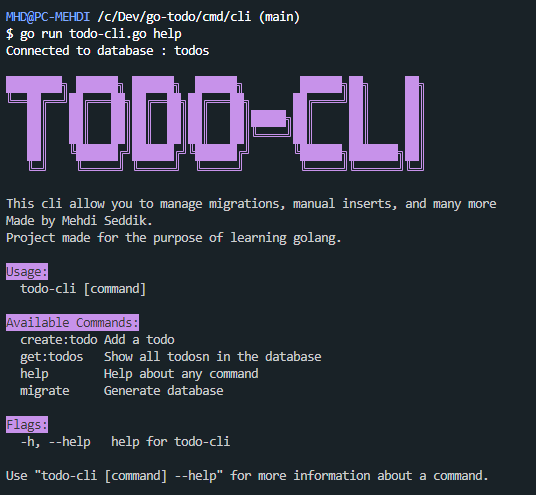

# Go-Todo Project

The Go-Todo project is a Golang application that consists of an API and a CLI tool. The API provides CRUD (Create, Read, Update, Delete) operations for a todo list, while the CLI tool allows you to manage migrations, list todos, and create new todos.
The goal of this project is to learn the goland language and its ecosystem.

## API

The API component of the project is responsible for handling interactions with the todo list.

### Endpoints

Create Todo - `POST /api/v1/todos/new` |
Create a new todo item. You can provide the title and description of the todo in the request body.

Get Todo - `GET /api/v1/todos/{id}` |
Retrieve the details of a specific todo item based on its ID.

List Todos - `GET /api/v1/todos` |
Get a list of all todo items.

Update Todo - `PUT /api/v1/todos/{id}` |
Update the details of a todo item. You can provide the new title and description in the request body.

A postman collection is provided in `docs/postman_collection.json`

### Usage

first copy paste the .env.example file to .env and change the values accordingly to your database configuration

To run the API, navigate to the `cmd/api` directory and execute the following command:

```bash
go run main.go
```

The API will be accessible at <http://localhost:8080>.

# CLI

The CLI component of the project provides a command-line interface for managing migrations and interacting with the todo list.

Available commands are listed in the help page:



### Usage

To use the CLI, navigate to the `cmd/cli` directory and execute the appropriate commands. For example:

```bash
go run main.go migrate
```

or

```bash
go run main.go get:todos
```
